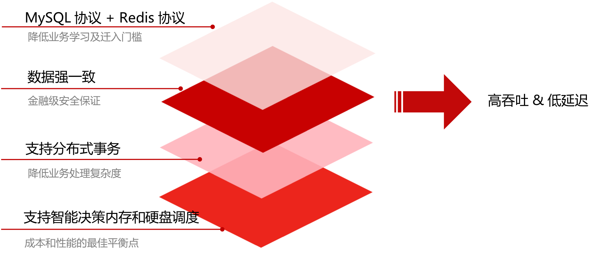
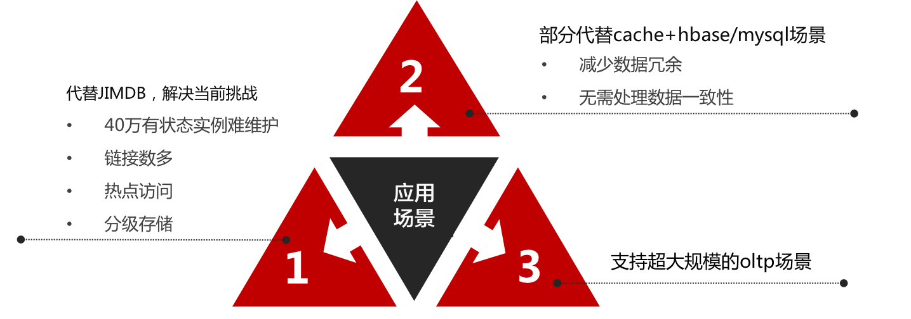

# JimDB新一代

JimDB新一代是一款高性能、低成本、云原生的分布式数据库，使用内存、磁盘混合存储，支持Redis、MYSQL两种协议

## 关键特性

#### 高性能
* 以内存为中心
* 出色的读性能 + 良好的写性能

#### 低成本
* 支持内存+硬盘双存储引擎
* 智能调度冷热数据分离存储

#### 在线schema变更

#### 高可用，高可靠
* 基于raft进行一致性复制
* 自动扩容、均衡、故障切换

## 适用场景

#### 1、数据仓库

可以存储和处理海量数据，支持高并发的实时读写， 

比如订单数据库，交易数据库，存储数据库，信息采集数据库等等

#### 2、替换MySQL数据仓库

 大数据量下，数据增长很快，接近单机处理大极限，

 不想分库分表或者使用数据库中间件等对业务侵入型较大、对业务有约束的Sharding方案 

JimDB新一代业务层支持MySQL协议，并提供迁移工具

#### 3、缓存加速数据仓库

JimDB新一代的低延迟、点读性能媲美redis，单实例支持更大的吞吐、在需要提供缓存进行系统加速的场景

#### 4、金融级OLTP业务

JimDB新一代具备高可用、强一致、可扩展等特性，具备金融级安全保证，支持金融级OLTP业务

（交易、支付、账单、结算、金融等等）

## 系统架构

