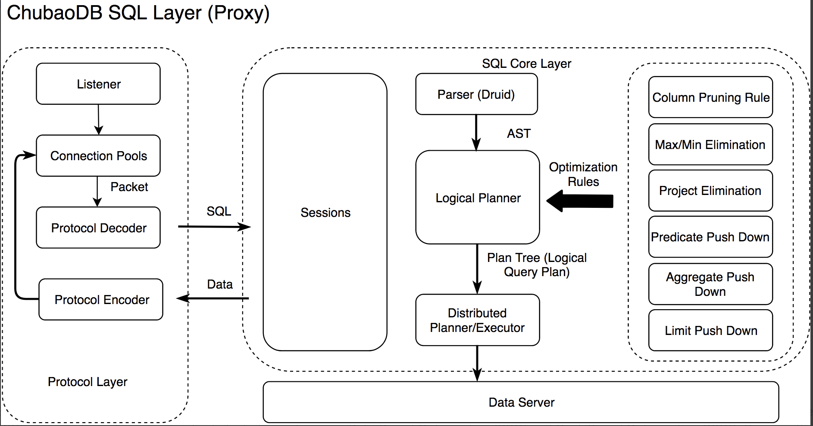
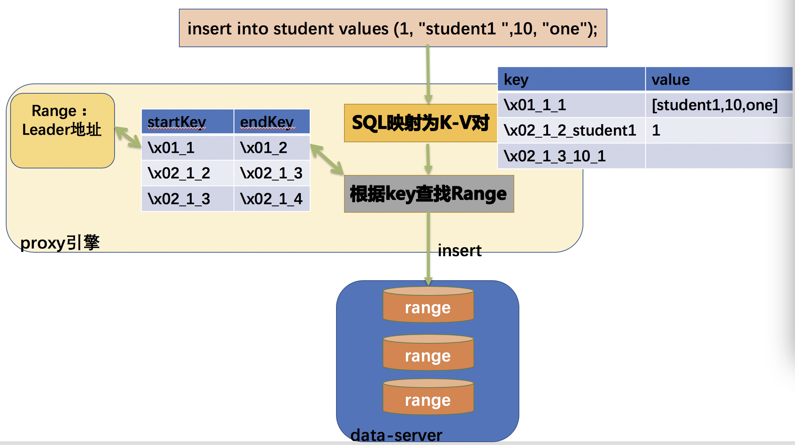
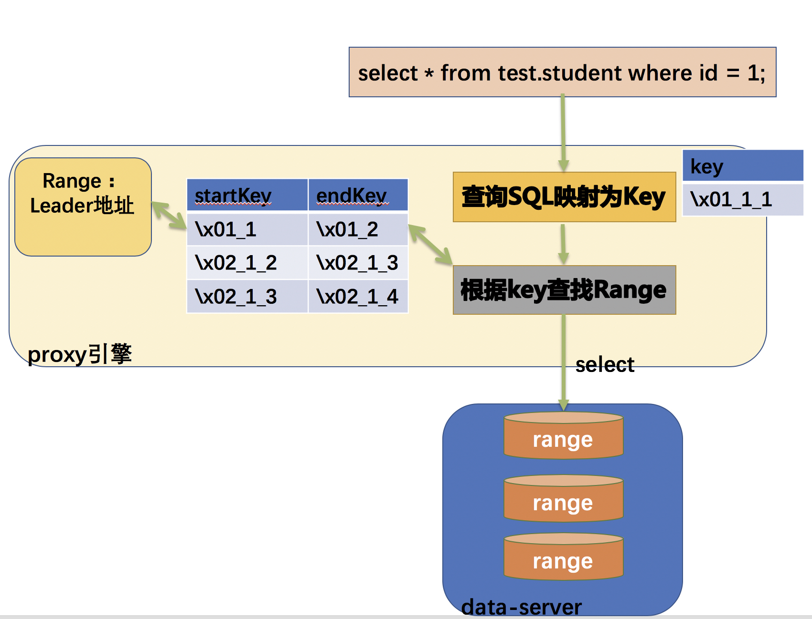

# 整体架构

上图是SQL引擎的整体架构：其中左边是协议层，主要负责管理用户连接，解析用户SQL，
并将处理好的结果数据封装成MySQL协议形式返回给客户端。中间的Session Context主要负责处理session变量。SQL经过parser解析成AST，然后经过Optimize、SQL执行引擎、存储层协处理器得到计算结果。
协处理器支持简单的表达式计算、data scan、聚合等，将大量操作下推到协处理器上可以极大减少data server与SQL引擎数据交互带来的网络开销，
也能让一部分计算在data server上分布式并行执行。


# 编解码设计

假设存在一个库表test.student定义：
```
CREATE TABLE student (
id BIGINT,
name VARCHAR(32),
age TINYINT,
class VARCHAR(16),
PRIMARY KEY (`id`),
UNIQUE KEY `idx_name` (`name`),
INDEX `idx_age` (`age` )
);
```
其中，student表存在id主键、基于name列的唯一索引及基于age列的非唯一索引。

JimDB新一代采用行存的方式，将SQL的行数据映射为底层key-value存储。底层key-value负责存储两种数据：业务数据（row data）和索引数据(index data)。表中每行数据按照如下规则编码成key-value对<rowPrefix_tableId_pkValues,columnValues>：

<table>
  <tr>
    <th colspan="3">key</th>
    <th>value</th>
  </tr>
  <tr>
    <td>rowPrefix</td>
    <td>tableId</td>
    <td>pkValues</td>
    <td>columnValues</td>
  </tr>
</table>

其中，rowPrefix行数据前缀为特定字符，占用1个byte；tableId占用8个byte；pkValues: 是主键值编码的数据，
pkValues的编码是有序编码；columnValues是除主键外的其它列编号+列值的编码。

行数据对应的二级索引数据按照如下规则编码成key-value对：
<table>
  <tr>
    <th>索引</th>
    <th colspan="5">key</th>
    <th>value</th>
  </tr>
  <tr>
    <td>唯一索引</td>
    <td>indexPrefix</td>
    <td>tableId</td>
    <td>indexId</td>
    <td colspan="2">indexColumnValues</td>
    <td>pkValues</td>
  </tr>
  <tr>
    <td>非唯一索引</td>
    <td>indexPrefix</td>
    <td>tableId</td>
    <td>indexId</td>
    <td>indexColumnValues</td>
    <td>pkValues</td>
    <td>null</td>
  </tr>
</table>	

其中：indexPrefix索引数据前缀为特定字符，占用1个byte。

当我们使用以上SQL到key-value编码方案，可以将行数据跟索引数据转换为key-value数据，且唯一。一个表的行数据有相同的前缀，
一个索引的数据也有相同的前缀，同时key的后缀也是有序的，能够保证行数据或者索引数据在底层存储是有序存储的。

定义：
```
rowPrefix=\x01
indexPrefix=\x02
```

当我们创建完表结构后，每个table对应分配一个全局唯一的tableId，每个索引有indexId。

假设student表的tableId为1，idx_name的indexId为2，idx_age的indexId为3，则student表:
> row data存储范围为[\x01_1,\x01_2)

> index data的存储范围为:[\x02_1_2, \x02_1_3), [\x02_1_3,\x2_1_4）。

其中范围都是左闭右开的。

将(1, ”student1”, 10, ”one”)行数据按照编码规则映射为key-value对:
> <\x01_1_1, [”student1”,10,”one”]>

除此，对应的二级索引数据key-value对：
>基于name的索引： <\x02_1_2_”student1”,  1>

>基于age的索引： <\x02_1_3_10_1, null>

这样，table的row数据按主键有序存储，index数据各自有序存储。

# 读写流程

DML操作，主要包括insert、update、delete和select语句操作。现基于创建的student表说明读写流程。

* insert into test.student (id,name,age,class) values (1,”student1”,10,”one”);
> proxy存储引擎将行数据按照编码规则映射为key-value对，<\x01_1_1, [”student1”,10,”one”]>，见上文所述。
根据key值定位到应该写入的分片Range所在的data-server，发送insert操作。


* select * from test.student where id = 1;
> 根据id=1的点查询条件，可以构建出key=\x01_1_1；根据key值定位该查询所在分片Range及data-server地址；发送select操作。


* update test.student set name = “student2”, age = 15 where id = 1;
> 根据id=1的查询条件，可以构建出key=\x01_1_1；根据key值定位到该查询所在分片Range及data-server地址并读取key-value对；
然后解码成对应的列值，将update的列值跟查询的结果合并为key-value对；然后再发送update操作。

* delete from test.student where id = 1;
> 根据id=1的查询条件，可以构建出key=\x01_1_1；根据key值定位到应该删除的分片range及data-server地址；发送delete操作。


# 优化器概述
优化器需要考虑算子的下推，比如filter的下推，尽量下推到数据源，这样能减少所有执行数据的计算量。

SQL优化器分为逻辑优化阶段和物理优化阶段，逻辑优化阶段的输入是一个逻辑执行计划，有了初始逻辑执行计划后，去应用各种rule，
每一个rule必须保证输入的逻辑计划与输出的逻辑计划在逻辑上是等价的。逻辑优化与物理优化的区别在于逻辑优化不区别数据的形态是什么，
它并不会去区分聚合算子是stream还是hash，同时也不要求rule产生的每一个新的逻辑执行计划一定要比原来输入的逻辑执行计划要更优，
如将一些算子下推到数据源比不下推下去要更优，下推后上层处理的数据量变少，整体计算量就比原来少。


# 逻辑计划优化
逻辑计划优化主要是基于规则的（Rule-Based Optimization (RBO))。我们已经实现的一些逻辑优化规则，如 Column Pruning 就是裁减掉一些不需要的列；
Group By Elimination指的是聚合时Group By的列是表的唯一索引时可以不用聚合；
Project Elimination是消除一些中间的没用的一些投影操作，产生的原因是在一些优化规则以自己实现简单会加一些Project

# 物理计划优化
物理计划的优化是基于代价的（Cost-Based Optimization (CBO)。逻辑优化并不决定以什么算法去执行，而物理优化需要考虑不同的节点，
不同的算法对输入输出有不同的要求，如 hash aggregation 和 streaming aggregation 实现的时间复杂度本身不一样。

在物理优化中比较重要的一点是如何选择索引，没有索引一个慢查询会导致所有集群都慢。


# 统计信息
统计信息是用来估算row count，需要估算的row count有filter和聚合。统计信息有直方图，主要用于估算范围查询的统计信息，被覆盖的其count直接加上去，
部分覆盖的桶使用连续均匀分布的假设，被覆盖的部分乘以桶的 rowcount 加上去；另一个是估算点查询的 rowcount，可以理解 Min-Sketch，
只是估算的值不再是 0 和 1，数据代表是这个位置被 hash 到了多少次，如一个数据有 D 个 hash 函数，将其 hash 到 D 的某个位置，对具体位置加上 1，
查询也做同样的操作，最后取这 D 位置最小的值作为 count 估计，这个估计在实际中精度较高。

收集统计信息的方式有很多，首先手动执行 analyze 语句做统计信息的搜集；也可以配置自动 analyze，就是表的更新超过某些行数会自动做 analyze。