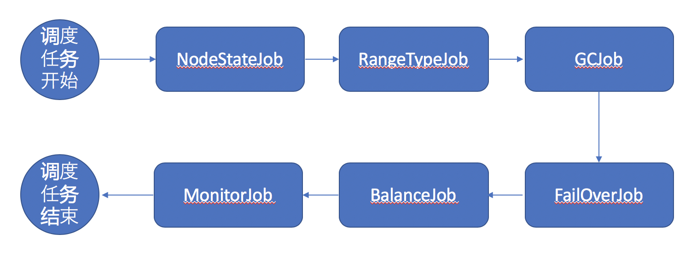

# 调度任务

## 1 调度任务介绍

### 1.1 整体架构

调度任务是Master的核心模块。其中包含了Failover、Balance、Mointor等工作。调度任务是一个排它进程，默认1分钟发起一次，发起后其他master不能再执行，直到本次调度任务结束或者异常退出，1分钟后再次进行调度。

调度任务以线性执行，任务流程具有先后的性质。下图为调度任务的线性流程

 

 

### 1.2 NodeStateJob

节点状态检查。

当发生ds节点需要升级或者下线的时候，管理员会将此节点标记为`update` 或者 `offlie` 状态, 此时当标记完成后下次调度任务触发时，就会进入此Job。

如果发现ds被标记为 `update` 则会将此节点上所有的leader进行转移， 直到完成；如果发现ds被标记为 `delete`状态，则会将此ds的全部range转移到其他ds上，注意当因为集群状态不正确，错误的设置了这些标记，会停止后续的调度，因为发生了不可预期的错误，需要管理员人工来解决了。或将状态标记回去

### 1.3 RangeTypeJob

当某个Range因为长时间读写状态恒定，或者管理员手动将Range的状态标示为`warm`或者`hot`

此时RangeTypeJob启动发现标记和实际Range所在ds不符合就发生此操作，此操作会将此range转移到合适的ds上并删除此节点上的range。

### 1.4 GCJob

GCJob，顾名思义，就是发现集群中的垃圾信息，对垃圾信息进行回收。

GCJob发生后
1. 先检查NodeRange，是否有Range所在的Node已经离线，但是Range没有回收完毕，如果有就进行回收 
2. 再检查是否有ange所在Table被删除，但是range没有被正确回收，如果有则进行删除。
3. 最后检查Table，是否存在Table所处的database已经被删除，如果有则对Table进行回收。

### 1.5 FailOverJob

FailOverJob，是对某些Range健康进行检查修复的的工作
1. 第一步检查Range的个数是否小于table设定的副本数，如果是就补充Range
2. 第二步检查Range的个数是否大于table设定的副本数，如果是就删除较忙碌的ds上的range
3. 第三步检查是否有节点挂掉，默认挂掉时间大于5分钟认为此range失效，这个时候会对range进行摘除工作

### 1.6 BalanceJob

BalanceJob，是对节点进行均衡调度的工作，均衡分两个部分，`leader平衡`和`range平衡`。

因为leader 均衡代价较小，所以首先进行leader均衡，均衡完毕后检查拥有相同类型最大最小的ds差距，如果大于2则进行 转移，从最大的ds转移到小于平均数或者最小的ds中。直到集群leader和ds数达到均衡为止

### 1.7 MonitorJob

MonitorJob，是一个用来监控的Job，会统计集群信息提交到普罗米修斯中用来查看集群情况。

## 2 Split Range介绍

### 2.1 整体思路

当Range插入数据达到一定量后，由ds发起拆分，ds会检查当前range的状态是否满足拆分条件，如果满足会请求master的/range/ask_split 接口请求元数据予以拆分的一个过程

### 2.2 流程详解

* Master收到askSplit请求，获取请求内容，包含需要拆分的Range
* Master判断整个集群是否禁止了拆分，如果禁止则返回 `ErrorType_NotAllowSplit`
* 否则检查Range所在table的状态，如table是否存在、table是否为正常运行状态
* Master检查请求的Range是否大于本地Range的版本 如果小于则拆分失败
* 根据table分副本数创建replica个Peer 
* 将分裂后新的RangeID、Peers返回给ds server。split流程完毕
