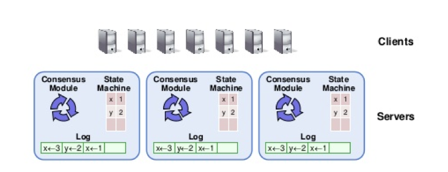
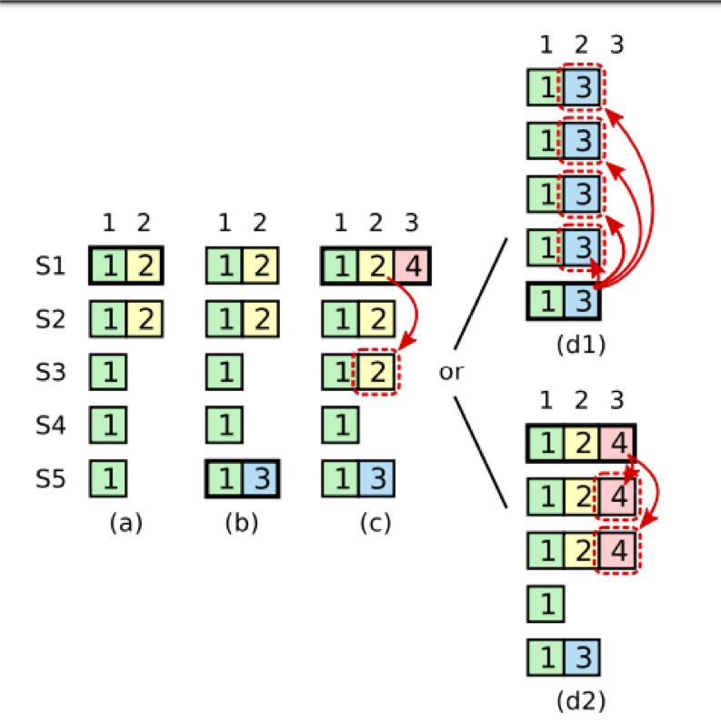

# Raft一致性算法

## 1 简介

### 1.1 Raft使用场景

为了实现分布式系统的高可用性，往往会部署多个副本来进行容错。

Raft是一种一致性算法，它可以解决分布式环境下多个副本上的数据一致性问题。 
相对Paxos，Raft是更易于理解的。

Raft算法也同时能满足系统的高可用性： 
即容忍集群内一半以下节点的失败。比如5个节点的集群最多可以允许宕掉2台，也可以正常工作。

### 1.2 Raft实现方式

Raft是基于可复制的状态机来实现数据的一致性的。

每个节点都有一个状态机、日志模块和一致性模块。
* 日志：交易记录或者写入请求
* 状态机：应用日志来更新状态。

一致性模块通过把日志按序完整地复制给每个节点，最终每个节点上的日志是一样的，那么每个节点的状态也会是一致的。

 

 

### 1.3 Raft是一个Strong Leader的算法

一致性模块主要由集群中的Leader负责，包括处理写入请求和向其他节点复制日志等。

Raft算法主要包括以下部分：
* Leader选举
* 日志复制
* 成员变更

## 2 leader选举

### 2.1 Leader由集群内的节点选举产生

每个raft节点一定处于以下三种状态之下：
* Leader
* Follower
* Candidate

Follower被动接受Leader消息；

Leader处理请求，向Follower复制日志、定时发送心跳维护自己的权威（阻止follower发起新选举）；

节点初始状态为Follower，Follower一段时间内（选举超时时间）收不到leader的心跳消息， 
就变为Candidate，发起新的一轮选举，向其他节点发起投票请求，得到大多数节点的同意，就可以成为新的Leader。

两个时间：heartbeat 和 election timeout。后者要大于前者，典型值5-10倍

 

 

### 2.2 每个节点都维护一个term的状态，一般为uint64类型

term表示一个分布式的logical time

节点收到低于自己当前term的消息，就识别为过时的。

每开始新的一轮选举，candidate首先将自己的term + 1。

同一个term只会产生一个leader。这是因为

* 投票约束1： 
对于同一个term，节点只会给一个candidate投票。 
即一个term，不存在两个candidate（term一样）同时能得到大多数的投票。 
具体实现里每个节点维护一个持久化的变量（vote_for)，记住给谁投过票

* 投票瓜分： 
为了避免同时有两个（或多个）节点同时发起选举，瓜分投票导致选不出leader 
Raft对每个节点的选举超时时间（election timeout）进行了随机化处理

* 投票约束2： 
请求者的日志需要比自己节点的日志新，不然拒绝 
Candidate在向其他节点发送投票请求时，会同时携带自己最新日志的index 和 term。 
节点收到投票请求后，会跟自己最新的一条日志比较请求者的日志，如果不比自己的新，则拒绝投票请求。 
日志新：先比较term，term大的新；term一样比较index， index大的新。 

约束2的目的：某个term内已提交的日志，一定会在未来（term更大）的leader节点上存在。Leader Completeness原则选举出leader之后，就可以接收客户端的请求了。

 

 

## 3 日志复制

### 3.1 一条请求的路径

1. Leader生成一条新的日志添加持久化到自己的log存储中； 
每条日志都有一个递增的log index、提交时leader所在的term和请求内容组成。

2. Leader向其他Follower节点复制该条日志，Follower接收日志并持久化；

3. 当Leader把日志复制给集群中的大多数节点后，该日志就是可被提交的（committed），  
Leader就可以应用这条日志，并且把应用的结果返回给客户端。

4. 同时Leader告知Follower commit位置，Follower收到后开始应用这条日志。

日志的应用时可以异步地进行，这需要节点维护另一个状态：应用位置 apply index
                             	                                          
### 3.2 复制失败的重试：

Leader复制日志的时候有可能会遇到复制失败的情况，比如网络原因，这时候Leader会一直重试。

实现中Leader会跟踪记录每个Follower复制的进度，每次复制都从进度的下一条开始。

### 3.3 不同节点上日志的一致性

Leader发生复制请求时会携带前一条日志的index 和 term，如果Follower上有相同的index和term的日志，则说明这
之前的日志都是一致的，可以复制；不然则返回失败。

日志的index和term一样，则内容就一样。因为一个term只有一个Leader，一个Leader在一个index处只有一个日志。如果上一条日志内容不一样，则本条不会复制成功，以此类推，之前所有日志都是一致的。

 

 

### 3.4 日志冲突

当出现Leader崩溃重启或者网络分区的时候，有可能会出现日志的冲突。

raft的原则是一切以当前任期Leader上的日志为准，Leader不会截断自己的日志。

Follower收到冲突的日志复制请求后，会截断自己跟Leader不一致的日志。

典型的例子：在客户端发起一个请求后等待回应期间，Leader崩溃了，发生Leader切换
那么这个请求未来会不会被集群应用都是有可能的（取决与是否复制给了大多数）。

Raft不提供exactly once语义，也就是说只有幂等的操作才是安全地。 
当发生Leader切换后，新Leader不会主动commit前任leader任期内的未commit日志，
因为它不知道这些日志是否已经复制给了大多数。 
一般新Leader选举出来后，需要提交一条空日志，来探测各个副本的进度，尝试提交前任的日志。

 

 

为什么提交前任leader的日志是不安全的，即使知道日志已经复制给了大多数

 

 

### 3.5 日志压缩和快照

日志不可能无限制地增长，日志达到一定的量级就需要进行压缩。

压缩的方式是对状态机的状态dump一份（快照），并且记下快照时状态机应用到了哪个位置（apply index），
然后这个位置之前的日志都可以清理掉。

当某个Follower（比如新增一个节点，状态机是空的）需要复制的日志已经被Leader清理，Leader就需要
发送快照给该Follower（相等于一份全量数据），然后从快照之后的位置开始日志复制（增量数据）。

另外一个需要快照的场景是：有时候复制大量历史操作日志更慢，不如直接复制一份全量数据。

## 4 成员变更

成员变更即往集群中添加成员或者删除集群中的成员。

增删成员可以向Raft通过提交一条特殊的配置更改命令来完成，但由于各个节点的日志进度和应用快慢可能不同，在某一时刻集群内可能同时存在新旧两种配置，有可能导致集群内出现多个Leader。

quorum(old) + quorum(new) <= max(成员个数)  

one-by-one 
成员变更时，只能新增或删除一个成员；并且同时只能进行一次成员变更操作，下一次成员变更必须等上一次的完成。

 

 

## 5 一些实践中的问题

### 5.1 添加监控

比如集群丢失leader（几秒或几分钟之内一直选不出leader）；

短时间内集群leader切换频繁；

follower节点的复制进度等；

### 5.2 故障恢复

主要是某个副本宕机后的集群的恢复工作

比如可以由raft的leader通过心跳消息来检测其他副本的健康状况，当发现副本发生故障后，通过raft的成员变更删除故障副本，再补一个新的副本

### 5.3 网络分区

出现网络分区后，可能会出现新旧两个leader。

需要引入租约机制来解决分区的问题，被分出去的旧leader（少数派）在lease过期后，放弃leader身份；

### 5.4 应急方案

在集群的大多数节点同时宕掉后，Raft无法正常工作，如何恢复

比如可以以某个副本的数据为基础，重新bootstrap一个新的集群，可能会丢失部分数据

### 5.5 Multi-Raft

由于日志的复制是顺序的，且日志的应用也是单线程的，单个raft的性能是有限的。

因此现实中往往需要引入多个raft group，不同的group可以并行，来提升raft的性能

新的问题：心跳合并；Leader平衡；
