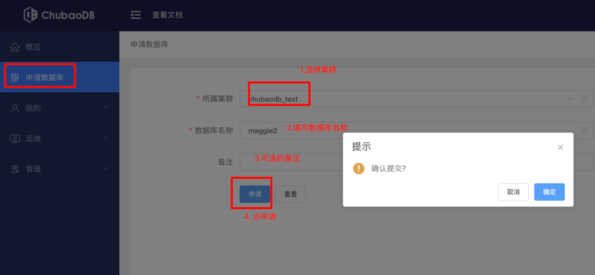
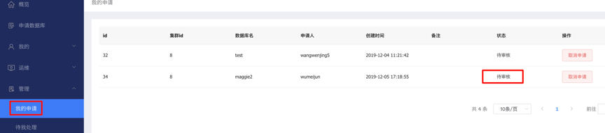
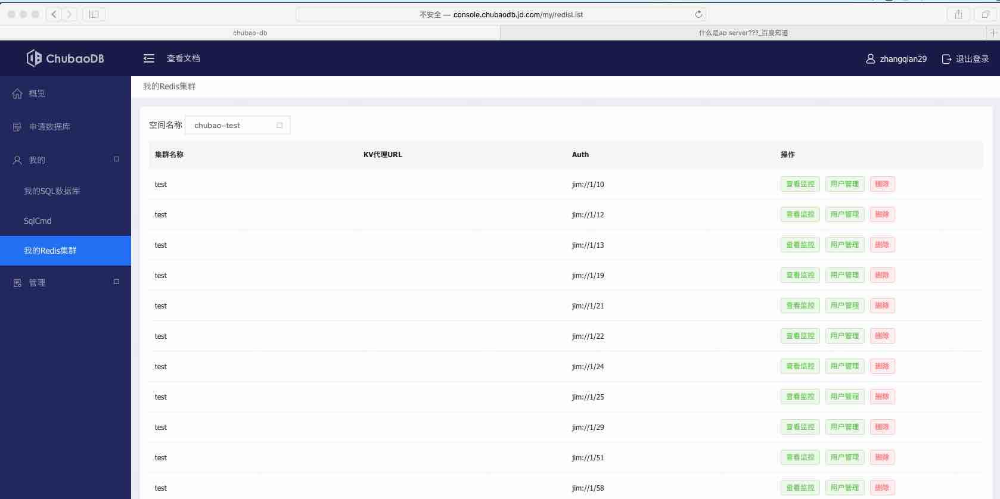

# 快速接入手册
##1.	什么是AP
+ AP就是代理服务;
+ 可以把AP看作redis单实例,主要作用就是向JimDB新一代分发请求;
+ AP是一款完全兼容redis功能的服务端,目前实现了redis的部分功能,能够通过官方redis客户端(redis_cli)和sdk访问服务端。

##2.	使用AP接入的优势
+ 支持所有语言,使用官方推荐的redis客户端就可以直接接入;
+ AP可以在服务端升级,无需客户端应用修改代码重新上线;
+ 支持pipeline发送请求;
+ 支持mset/mget/del多key命令操作;
+ Lua脚本不支持多key操作。

注: 使用ap不需要关心集群、分片等细节;

##3.	AP目前支持的redis命令
当前版本主要支持string和hash两种数据结构,支持命令如下:
+ set key value
+ get key
+ del key
+ mset key1 value1 key2 value2 ....
+ mget key1 key2 ...
+ hset hash field value
+ hget hash field
+ hmset hash field1 value1 field2 value2 ...*
+ hmget hash field1 field2 ...
+ hdel hash field1 field2 ...
+ hgetall hash

##4.	登录管理端申请数据库
###4.1 管理端地址
测试环境管理端地址：
+ http://console.chubaodb.jd.com/  
+ (配置hosts: 192.168.56.236 console.chubaodb.jd.com)

+ 生产环境不需要配hosts
+ 线上环境管理端地址：http://chubaodb.jd.com/

###4.2 申请数据库获得jimurl
####4.2.1申请数据库
点击 "我的 -> 我的数据库"
 
 

"管理 -> 我的申请"，可查看提交的数据库申请
  

然后联系chubao人员审批申请。
申请完成，可以在 "我的 -> 我的redis集群" 查看到申请到审核完成的数据库列表。
  

测试环境使用chuabao_test集群即可，对应的AP连接地址端口为：192.168.183.67:16379。

##5.	AP测试环境使用
###5.1 配置hosts
+ 192.168.56.236 console.chubaodb.jd.com
+ 192.168.183.67 ap2.jd.local

###5.2 登录测试管理端(申请测试集群jimurl)
+ 测试环境管理端地址：
+ http://console.chubaodb.jd.com/  
+ 测试环境使用chuabao_test集群即可

###5.3 Ap连接地址：ap2.jd.local:**16379**
+ 先发auth命令,再发业务命令
+ 例如: 使用redis-cli连接(形式一)
```
redis-cli -h 192.168.x.x -p 16379
AUTH jim://xx/xxxx
ok
set a a
ok
get a
a
```
+ 例如: 使用redis-cli连接(形式二)
+ 把auth命令的参数当password传入，不需要显式调用auth命令
```
redis-cli -h 192.168.x.x -p 16379 -a jim://xx/xxxx
set a a
ok
get a
a
```

##6.	AP生产环境使用
###6.1 应用程序中配置AP服务连接地址
+ Ap连接地址：ap2.jd.local:**5360**
+ **生产与测试环境端口不一样**

###6.2 使用AP接入和使用原生redis客户端的区别主要有两点
+ Ap连接地址：ap2.jd.local:5360 (测试环境ap2.jd.local:16379)
+ 需要在建立连接时执行AUTH命令，选择接入的集群，格式为：AUTH jimurl
+ 某些语言的客户端（例如python)，只需要把auth命令的参数当password传入，不需要显式调用auth命令。
+ jimurl对应一个redis集群，如果应用需要访问多个集群，只需要用不同的jimurl建立连接就可以了。
+ Lua脚本里使用的所有键都应该 KEYS 数组来传递，并且不支持多key，例如
+ > eval "return redis.call('set',KEYS[1],'bar')" 1 foo
+ OK

###6.2 使用AP注意点
+ 使用AP接入应该避免把流量都打到同一台AP服务器上，否则不利于负载均衡，也有单点故障的风险。
+ 应当使用类似Java JedisPool的机制，使用连接池，每次请求从池中拿连接。

###6.3 代码示例
####6.3.1 Python代码示例（redis-py)
```
    >>> import redis  

    >>> pool = redis.ConnectionPool(host='ap2.jd.local', port=5360, password=[jimUrl]) 

    >>> r = redis.StrictRedis(connection_pool=pool)

    >>> r.set('foo', 'bar')

    True

    >>> r.get('foo')

    'bar'
```

####6.3.2 PHP代码示例 (phpredis)
```
$this->redis_obj = new Redis ();         

$this->redis_obj->pconnect ( 'ap2.jd.local', '5360' , 2.0, [jimUrl]);  // 我们这里用[jimUrl]作为persistent_id参数传入，在需要同时访问多个集群时，传入不同的 persistent_id用来区分不同的持久化连接。

$this->redis_obj->auth ([jimUrl]);

$this->redis_obj->set('phptest',3);
```

####6.3.3 Nginx+Lua代码示例
```
local redis = require "resty.redis"

local ngx_log = ngx.log

local ERR = ngx.ERR

local table_concat = table.concat


local util = require "jd.util"

--获取数据成功

local STATUS_OK = util.STATUS_OK

local STATUS_ERR = util.STATUS_ERR

local STATUS_NOT_FOUND = util.STATUS_NOT_FOUND


local HOST="ap2.jd.local";

local PORT="5360";

local TIMEOUT = 100;


local poolSize = 200

local poolMaxIdleMillis = 30000


--释放redis连接

local function release(redis, auth, key)

    if not redis then

        return

    end

    local ok, err = redis:set_keepalive(poolMaxIdleMillis, poolSize)

    --if not release, log error

    if not ok then

        ngx_log(ERR, "[" .. key .. "] [" .. tostring(auth) .. "] keep alive error : ", err)

    end

end


--连接redis

local function connect(auth, key)

    local red, new_err = redis:new()

    red:set_timeout(TIMEOUT)

    local ok, err = red:connect(HOST, PORT)

    --if err, direct return error

    if not ok then

        ngx_log(ERR, "[" .. key .. "] connect  server [" .. tostring(auth) .. "] error : ", err)

    end


    local ok, err = red:auth(auth);

    if not ok then

        ngx_log(ERR, "[" .. key .. "] connect  server [" .. tostring(auth) .. "] error : ", err)

        return nil;

    end


    return red, ok, err

end


local function redis_lpush(auth, key, value, umpKey)

    local redis = nil

    local ok = true

    local resp = nil


    local begin_time = gettime()

    redis, ok, err = connect(auth, key)

    if ok then

        resp, err = redis:lpush(key, value) --写入队列

    end

    release(redis, auth, key)

    if not ok or err then

        umplog(umpKey, "1", begin_time)

    else

        umplog(umpKey, "0", begin_time)

    end

end


local function redis_get(auth, key, umpKey)

    local redis = nil

    local ok = true

    local resp = nil

    local begin_time = gettime()

    redis, ok, err = connect(auth, key)

    if ok then

        resp, err = redis:get(key)

    end

    if not ok or err then

        ngx_log(ERR, "[" .. key .. "] get from redis server [" .. tostring(auth) .. "] error : ", err)

        umplog(umpKey, "1", begin_time)

        release(redis, auth, key)

        return STATUS_ERR, nil

    end

    umplog(umpKey, "0", begin_time)

    release(redis, auth, key)


    if not resp or resp == ngx.null then

        return STATUS_NOT_FOUND, nil

    end

    return STATUS_OK, resp

end


local function redis_eval_mget(auth, keys, umpKey)

    local keysStr = table_concat(keys, "','")


    local redis = nil

    local ok = true

    local resp = nil


    local begin_time = gettime()

    redis, ok, err = connect(auth, keysStr)

    if ok then

        resp, err = redis:eval("return redis.call('mget', '" .. keysStr .. "')", 1, begin_time)

    end

    if not ok or err then

        ngx_log(ERR, "[" .. keysStr .. "] mget from redis server [" .. tostring(auth) .. "] error : ", err)

        umplog(umpKey, "1", begin_time)

        release(redis, auth, keysStr)

        return STATUS_ERR, {}

    end


    umplog(umpKey, "0", begin_time)

    release(redis, auth, keysStr)


    if not resp or resp == ngx.null then

        return STATUS_NOT_FOUND, nil

    end

    return STATUS_OK, resp

end


local function redis_mget(auth, keys, umpKey)

    local keysStr = table_concat(keys, "','")


    local redis = nil

    local ok = true

    local resp = nil


    local begin_time = gettime()

    redis, ok, err = connect(auth, keysStr)

    if ok then

        resp, err = redis:mget(unpack(keys))

    end

    if not ok or err then

        ngx_log(ERR, "[" .. keysStr .. "] mget from redis server [" .. tostring(auth) .. "] error : ", err)

        umplog(umpKey, "1", begin_time)

        release(redis, auth, keysStr)

        return STATUS_ERR, {}

    end


    umplog(umpKey, "0", begin_time)

    release(redis, auth, keysStr)


    if not resp or resp == ngx.null then

        return STATUS_NOT_FOUND, nil

    end

    return STATUS_OK, resp

end

local _M = {

    redis_lpush = redis_lpush,

    redis_get = redis_get,

    redis_mget = redis_mget,

    redis_eval_mget = redis_eval_mget,

    STATUS_OK = STATUS_OK,

    STATUS_ERR = STATUS_ERR,

    STATUS_NOT_FOUND = STATUS_NOT_FOUND

}

return _M
```
