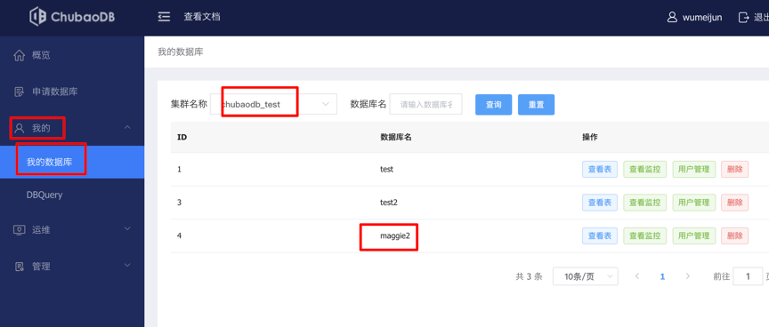
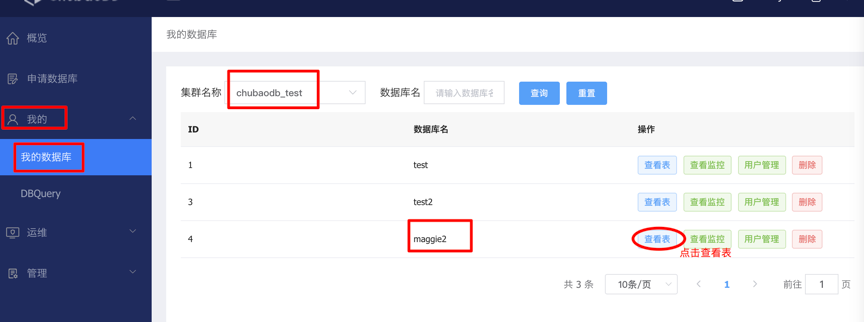
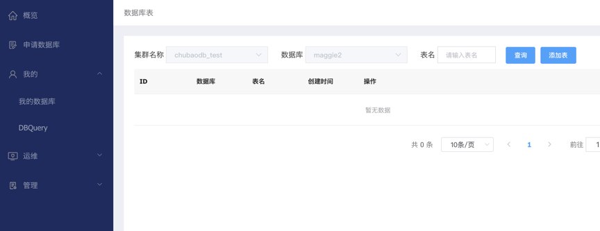
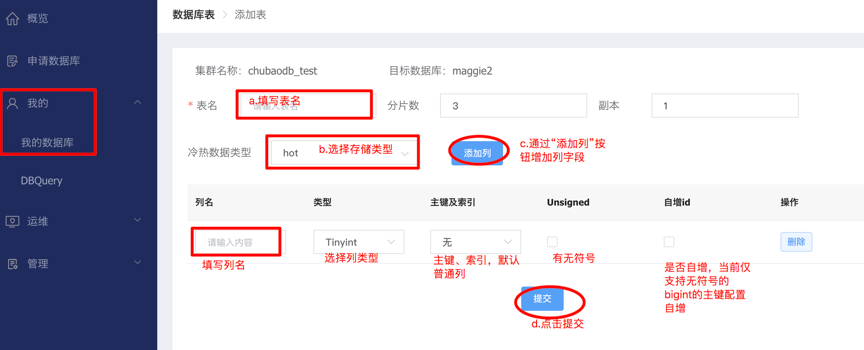
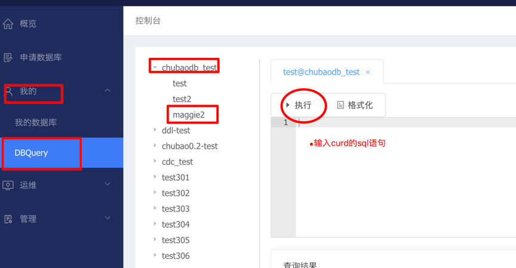

# 快速接入手册
##1.	使用前说明：
mysql协议兼容5.7，支持utf-8, 推荐maven配置
```
<dependency>
    <groupId>mysql</groupId>
    <artifactId>mysql-connector-java</artifactId>
    <version>5.1.48</version>
</dependency>
``` 
不支持prepare server cache，如果程序语句有prepare语句，需要jdbc配置参数， useServerPrepStmts=false&cachePrepStmts=false。 参加：http://doc.jd.com/chubaodb/docs/user-manual/mysql/prepare.html

##2.	登录管理端申请数据库、数据表
###2.1 管理端地址
测试环境管理端地址：
http://console.chubaodb.jd.com/  
(配置hosts: 192.168.56.236 console.chubaodb.jd.com)

线上环境管理端地址：http://chubaodb.jd.com/

###2.2 申请数据库、表
####2.2.1申请数据库
点击 "我的 -> 我的数据库"
 
 

"管理 -> 我的申请"，可查看提交的数据库申请
  

然后联系chubao人员审批申请。
申请完成，可以在 "我的 -> 我的数据库" 查看到申请到审核完成的数据库列表。
  

测试环境使用chuabao_test集群即可，对应的mysql连接地址端口为：192.168.183.67:3360。
####2.2.2 申请数据表
管理端 "我的 -> 我的数据库"，选择对应申请的集群，点查询，可以看到集群下的数据库列表。
   
	
点击要使用的数据库列对应的“查看表”按钮，可以进入表的列表页面。
   

点击“添加表”进入新建表页面：（ddl语句支持在下一版本）
    

```
a.填写表名；
b.选择存储类型，建议咨询JimDB新一代人员后再选。hot是数据索引都存储在内存；mix是数据存储在磁盘，索引存储在内存；warm是数据索引都存储在磁盘；
c.通过点击“添加列”来增加列字段
d.点击“提交”按钮，创建表。
e.其中，分片数是说 创建表的时候初始化几个数据块存储数据，副本数是说每个数据块存储几份。建议线上副本数3份。
```

##3.	应用程序中配置mysql服务连接地址

##4.	管理端DML操作
点击  “我的 -> DBQuery”, 点击对应的库、表， 输入sql即可查询、更新等。
   
